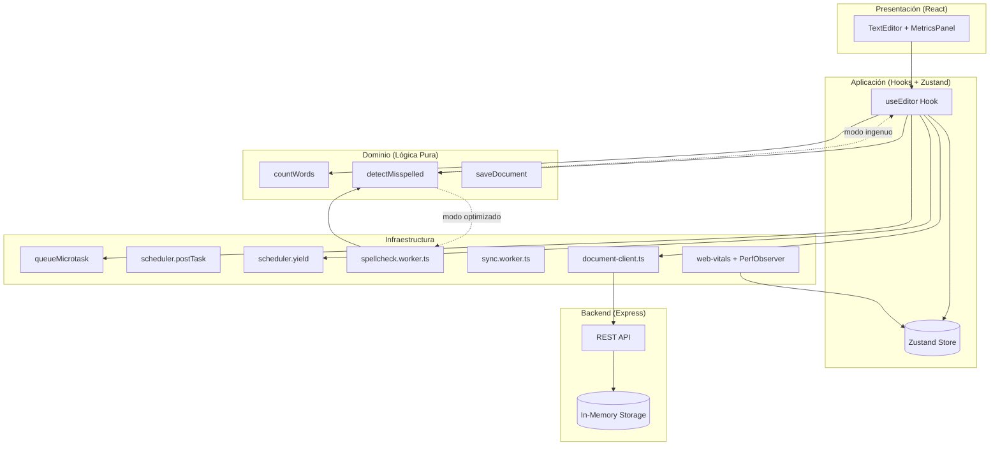
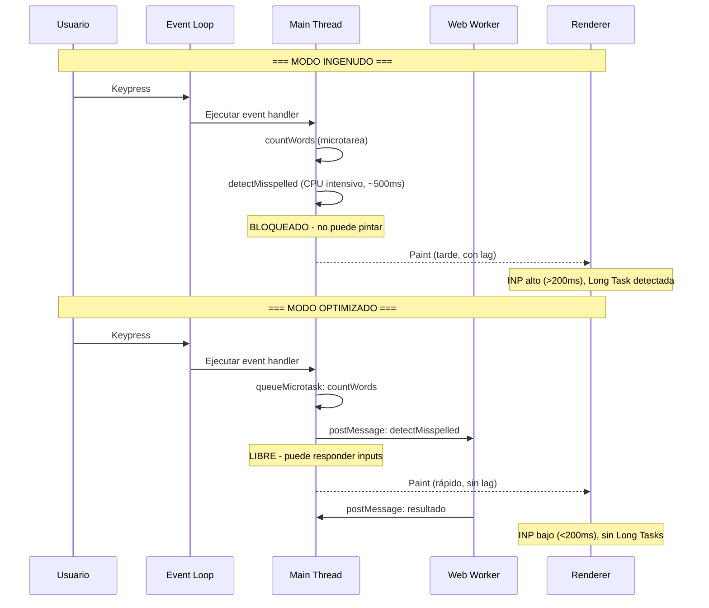
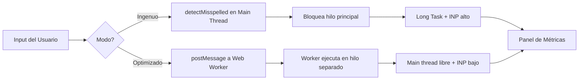

# Event Loop Lab — Editor Colaborativo

Caso de estudio educativo sobre el **Event Loop** de JavaScript, la diferencia entre **tasks (macrotareas) y microtareas**, y la métrica de rendimiento **INP (Interaction to Next Paint)**.

## Propósito Pedagógico

Esta aplicación es un editor de texto colaborativo simplificado que evidencia cómo el Event Loop del navegador maneja interacciones reales de usuario. Permite alternar entre dos modos comparables:

- **Modo "Ingenuo":** todo el trabajo pesado corre de forma síncrona en el hilo principal, bloqueando el render y causando long tasks.
- **Modo "Optimizado":** el mismo trabajo se distribuye usando microtareas, macrotareas programadas, Web Workers y `scheduler.yield()`.

Un panel de métricas en vivo muestra la diferencia de INP entre ambos modos.

## Diagrama de Arquitectura



## Diagrama del Event Loop — Modo Ingenuo vs Optimizado



## Diagrama de Flujo de Datos



## Conceptos Clave que Demuestra

### Event Loop
El Event Loop es el mecanismo que permite a JavaScript ser single-threaded pero manejar concurrencia. Procesa las colas de tareas en un ciclo:

1. Ejecuta la tarea actual (macrotarea)
2. Drena todas las microtareas pendientes
3. Pinta el frame si es necesario
4. Repite

### Microtareas vs Macrotareas

| Característica | Microtarea | Macrotarea |
|---|---|---|
| **API** | `queueMicrotask()`, `Promise.then()` | `setTimeout()`, `scheduler.postTask()` |
| **Se ejecuta** | Después de la tarea actual, antes del siguiente paint | Después del siguiente render |
| **Prioridad** | Más alta que macrotareas | Más baja que microtareas |
| **Caso de uso** | Actualizar estado inmediatamente | Debounce, trabajo diferido |

### INP (Interaction to Next Paint)

INP mide la latencia desde que el usuario interactúa (click, tecla, tap) hasta que el navegador pinta el siguiente frame. Se desglosa en:

- **Input Delay:** tiempo entre el input y el inicio del event handler
- **Processing Duration:** tiempo que toman los event listeners
- **Presentation Delay:** tiempo desde que terminan los handlers hasta el paint

Un INP < 200ms es "bueno"; > 500ms es "malo".

## Stack Tecnológico

- **Frontend:** React 19 + TypeScript (strict) + Vite
- **State:** Zustand
- **Métricas:** web-vitals/attribution + PerformanceObserver
- **Estilos:** Tailwind CSS
- **Backend:** Express (Node.js, in-memory)
- **Testing:** Vitest + React Testing Library
- **Linting:** ESLint + TypeScript-ESLint + Prettier
- **Despliegue:** Render (Docker)

## Cómo Correr Localmente

### Requisitos
- Node.js >= 18
- pnpm >= 9

### Instalación
```bash
# Clonar el repositorio
git clone <URL>
cd taller01

# Instalar dependencias
pnpm install
```

### Desarrollo
```bash
# Ejecutar frontend y backend simultáneamente
pnpm dev

# O por separado:
pnpm dev:frontend   # http://localhost:5173
pnpm dev:backend    # http://localhost:3001
```

### Tests
```bash
pnpm test           # Ejecutar todos los tests
pnpm --filter frontend test:watch   # Watch mode
```

### Lint, Format y Typecheck
```bash
pnpm lint           # ESLint en todos los paquetes
pnpm format         # Prettier: formatear todo el código
pnpm format:check   # Verificar formato sin modificar
pnpm typecheck      # tsc --noEmit en todos los paquetes
```

### Build
```bash
pnpm build          # Build de frontend y backend
```

## Estructura del Proyecto

```
taller01/
├── frontend/                    # React + TypeScript + Vite
│   └── src/
│       ├── domain/              # Lógica de negocio pura
│       │   ├── entities/        # Document, WordCount, Metrics
│       │   └── use-cases/       # countWords, detectMisspelled
│       ├── application/         # Orquestación
│       │   ├── hooks/           # useEditor, useAutosave
│       │   └── store.ts         # Zustand store
│       ├── infrastructure/      # Detalles técnicos
│       │   ├── scheduling/      # Wrappers de micro/macrotareas
│       │   ├── workers/         # Web Workers
│       │   ├── metrics/         # web-vitals + PerformanceObserver
│       │   └── api/             # Clientes HTTP
│       ├── presentation/        # Componentes React
│       └── shared/              # Tipos y constantes
├── backend/                     # Express server (mock)
│   └── src/
│       ├── routes/              # Endpoints REST
│       └── services/            # Storage en memoria
├── cloudbuild.yaml              # CI/CD para GCP
├── .prettierrc                  # Configuración de formato
└── DEPLOYMENT.md                # Guía de despliegue
```

## Cómo Interpretar las Métricas

1. **Activa el modo "Ingenuo"** y escribe en el editor
   - Observa las **long tasks** aparecer en el panel
   - El **INP** será alto (>200ms) porque el spell check bloquea el hilo
   - El **Processing Duration** dominará el desglose del INP

2. **Cambia a modo "Optimizado"** y repite la escritura
   - Las **long tasks** deberían desaparecer
   - El **INP** bajará significativamente
   - El spell check corre en un Web Worker (hilo separado)

3. **Compara los gráficos** del historial de INP para ver la diferencia visual

## Despliegue

Ver [DEPLOYMENT.md](./DEPLOYMENT.md) para instrucciones detalladas.

### Render (recomendado)

El proyecto se despliega como un **servicio Docker único** en Render. El backend Express sirve la API y los archivos estáticos del frontend.

```bash
# Probar el build de producción localmente
docker build -t editor-colaborativo .
docker run -p 8080:8080 -e NODE_ENV=production editor-colaborativo
# Abrir http://localhost:8080
```

En Render: conectar el repositorio → detecta `render.yaml` automáticamente → deploy.
